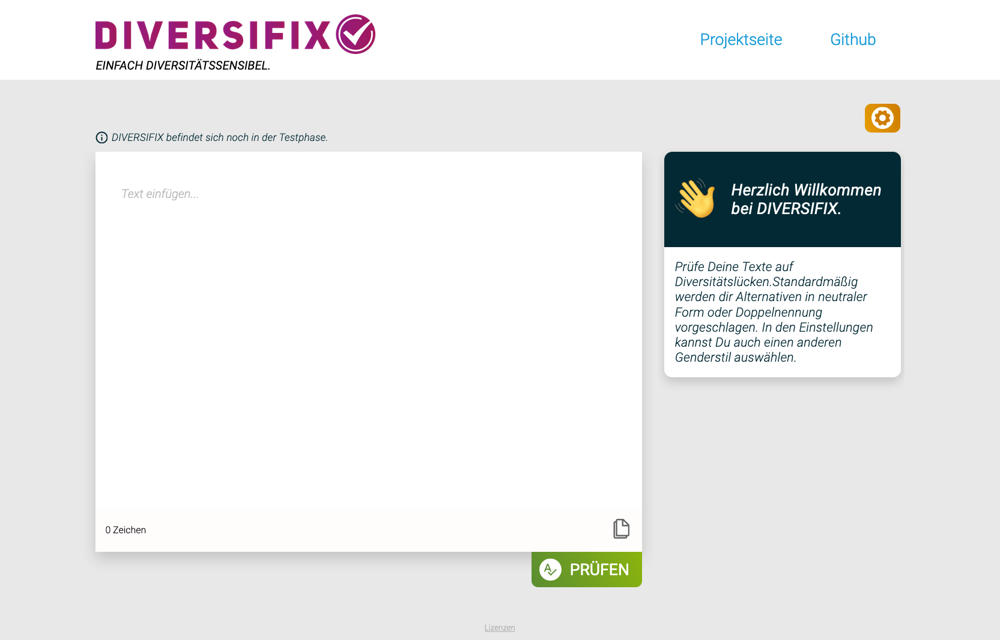
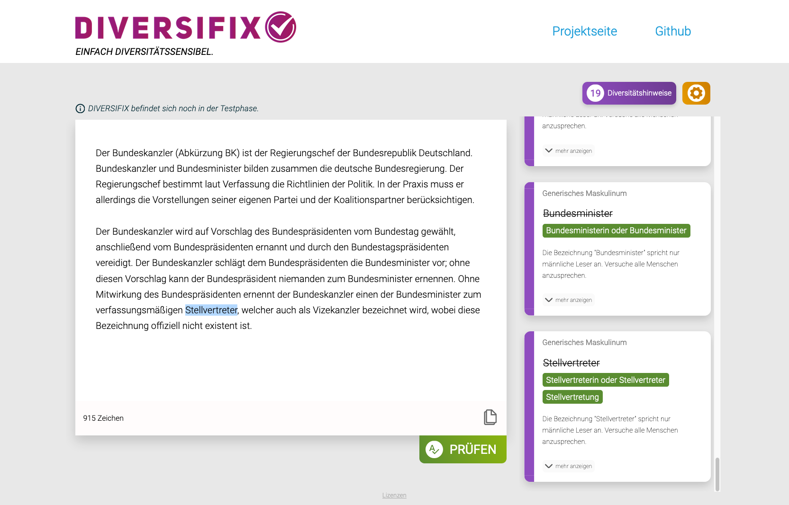

<h1></h1>

[Live Demo 🚀](https://diversifix.org/)

<a href="./doc/images/screenshot-diversifix-welcome-page.png"></a>
<a href="./doc/images/screenshot-diversifix-with-results.png"></a>

## About DIVERSIFIX

_DIVERSIFIX_ is a software to support the practical use of diversity-sensitive language in German. It was originally developed under the name _INCLUSIFY_ during the [Tech4Germany Fellowship](https://tech.4germany.org/) 2021 together with the [_Federal Institute for Materials Research and Testing_](https://www.bam.de/) (Bundesanstalt für Materialforschung und –prüfung (BAM)). We have now founded [Diversifix e. V.](https://diversifix.org/about) contribute to its development and adoption.

Our goal is both to promote awareness for diversity and to make every-day use of diversity-sensitive language easier.

DIVERSIFIX currently offers two modes of use:

1. A standalone webpage where users can paste their text, receive feedback and improvement suggestions, and apply these to their text in the browser.
2. An add-in for Microsoft Word, with which users can check their documents right in Word, receive feedback and improvement suggestions, and apply these to their document without leaving the app.

## Using the DIVERSIFIX Docker image

Make sure to have [Docker](https://www.docker.com/) installed and running.

Use the following command to download the DIVERSIFIX Docker image and start a new container. Note that the image is quite large and may take some time to download.

```sh
docker run --rm -p 80:80 -ti --pull always ghcr.io/diversifix/diversifix-app:latest
```

Now you can open http://localhost in your web browser and use the DIVERSIFIX web-app from there! 🥳

_Note: This Docker image hosts the app without HTTPS. This is fine for local testing, but isn't appropriate for any kind of deployment where other people use the app. For actual production deployments, consider putting an HTTPS reverse proxy in front of the DIVERSIFIX container._

## Technical Documentation

See [doc/index.md](./doc/index.md).

## License

This repository contains code and content we created ourselves, as well as content that we retrieved from other sources (some of it modified by us).

Our own source code and accompanying documentation in this repository are licensed under the [MIT license](./LICENSE). This applies to all files where no other license terms are included.

Files that are subject to other license terms are accompanied by appriopriate `LICENSE` files in the same or a higher directory.
