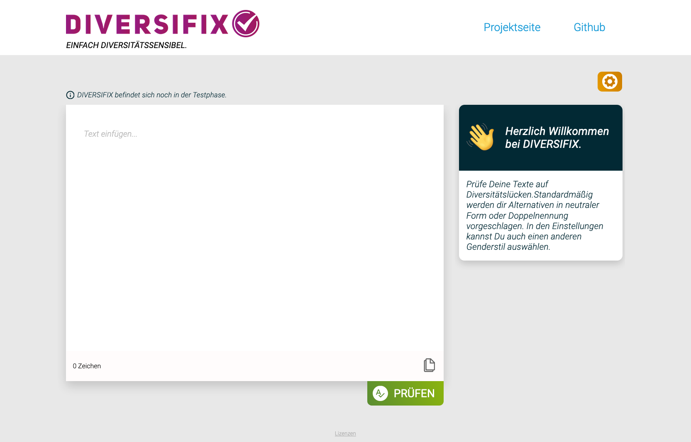
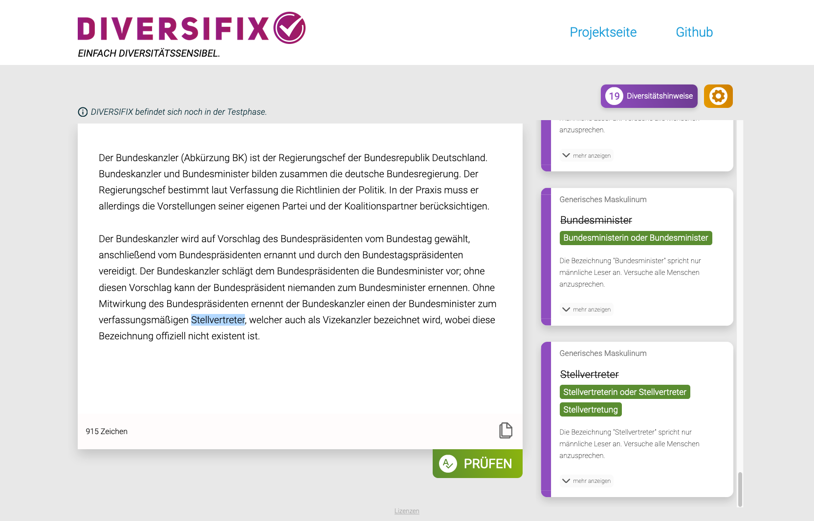

<h1></h1>

<a href="./doc/images/screenshot-diversifix-welcome-page.png"></a>
<a href="./doc/images/screenshot-diversifix-with-results.png"></a>

This is the DIVERSIFIX repository for the frontend parts: The Word Add-In, and the web application. It also includes code for the Docker image, which packages both the frontend and the backend. This repository is in restructuring, see the notes on the [organization page](https://github.com/diversifix).

## Using the DIVERSIFIX Docker image

Make sure to have [Docker](https://www.docker.com/) installed and running.

Use the following command to download the DIVERSIFIX Docker image and start a new container. Note that the image is quite large and may take some time to download.

```sh
docker run --rm -p 80:80 -ti --pull always ghcr.io/diversifix/diversifix-app:latest
```

Now you can open http://localhost in your web browser and use the DIVERSIFIX web-app from there! 🥳

_Note: This Docker image hosts the app without HTTPS. This is fine for local testing, but isn't appropriate for any kind of deployment where other people use the app. For actual production deployments, consider putting an HTTPS reverse proxy in front of the DIVERSIFIX container._

## Technical Documentation

See [doc/index.md](./doc/index.md).

## License

This repository contains code and content we created ourselves, as well as content that we retrieved from other sources (some of it modified by us).

Our own source code and accompanying documentation in this repository are licensed under the [MIT license](./LICENSE). This applies to all files where no other license terms are included.

Files that are subject to other license terms are accompanied by appriopriate `LICENSE` files in the same or a higher directory.
