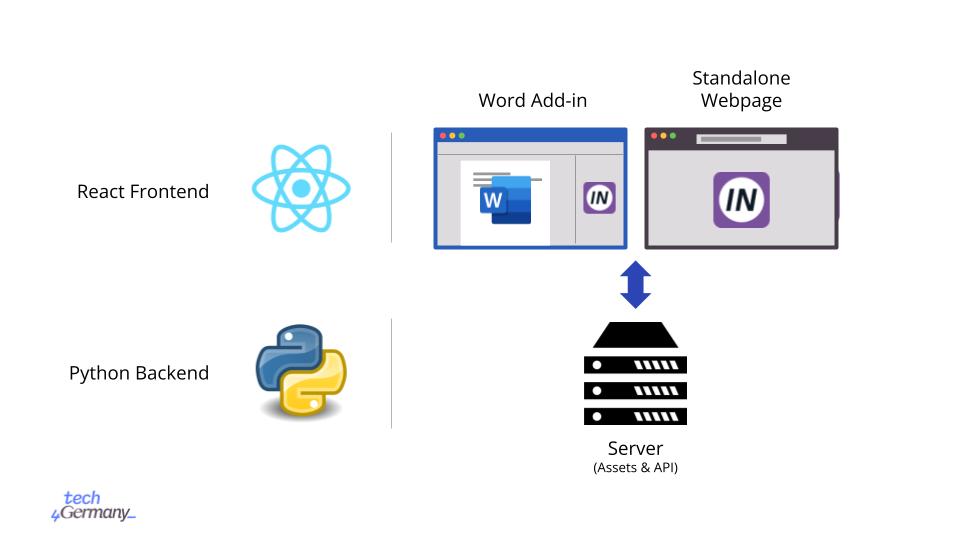

# System Overview & User Flow

## System Overview

The DIVERSIFIX App system has a classic server-client architecture.

The client is a React single-page application (SPA) frontend that can be used either standalone in a web browser or as a an add-in for Microsoft Word.

The server is a Python backend that serves the static assets for the frontend and provides an API to analyse the users' texts.

## Application user flow

The high-level user workflow of the DIVERSIFIX App works as follows:

- **User writes text.** This may happen in the text field of the Standalone web page, or the user may copy-paste their text into the text field, or they may compose their Word document and use the add-in.
- **User triggers check.** Currently, this happens either manually clicking a button or automatically when applying a replacement suggestion (see below). In the future, automatically (re)checking the text after the user changes it could be implemented.
- **System captures relevant text.** (React Frontend) In the Standalone web page, this is just the whole plaintext content of the input text field. In the Word add-in, the system fetches the document content from the Word application and extracts the plain text from Word's internal representation.
- **System analyzes text and computes suggestions.** (Python Backend) Using an NLP pipeline, the system finds parts of the user's text that could be made more inclusive and diversity-sensitive, and tries to suggest improvements.
- **System presents suggestions to user.** (React Frontend) The flagged text parts and improvement suggestions are presented to the user, usually including an explanation.
- **User views suggestions.** If the user is done working on the text for the moment (e.g. when there are no more suggestions, or the user decides not to make any more changes), this ends the user flow.
- **User makes adjustments.** Alternatively, the user may make further adjustments to the text, e.g. applying a suggestion provided by the system (this automatically triggers a re-check of the modified text), making manual changes, or adding more text.
  - Note: Text replacement suggestions are currently implemented using a purely index-based approach in the plain-text representation of the user's text. Changes to the input text are not tracked, so replacements cannot be applied correctly when the input text changes. As a result, changing the input text disables any suggestions currently being presented.
